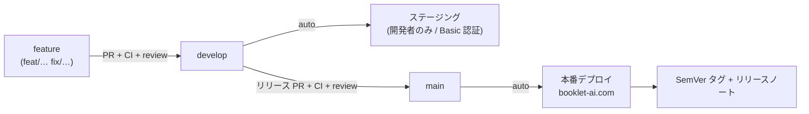

# Contributing

shiori（旅のしおりアプリ）の開発手順。UI の一貫性など実装上の規約は [`CLAUDE.md`](CLAUDE.md) を参照。

## 開発環境のセットアップ

### 必要なもの

- **Node.js 24** — リポジトリ直下の [`.nvmrc`](.nvmrc) で固定。標準の `node:sqlite` と TypeScript の型ストリップ（`node server/index.ts`）をフラグ無しで使うため、24 系に揃える（`package.json` の `engines.node` は `>=24`）。
- **pnpm 9 以上** — `packageManager` に `pnpm@9.15.0` を固定済み。`corepack enable` で有効化できる。
- **Docker** — ローカルの Firestore エミュレータ（`pnpm dev` / `pnpm test` が起動する）。

```bash
# nvm 利用時。リポジトリ直下で .nvmrc の Node を使う。
nvm use            # 未インストールなら nvm install

corepack enable    # pnpm を有効化（未導入の場合）
pnpm install       # 依存をインストール（--frozen-lockfile 相当は CI 側）
```

### 環境変数（AI アシスタントを使う場合）

```bash
cp .env.example .env   # GEMINI_API_KEY などを設定（使わなければスキップ可）
```

主要な変数は [`README.md`](README.md#configuration) を参照。

## 日常の開発コマンド

```bash
pnpm db:init       # サンプルデータを SQLite に投入（初回）
pnpm db:reset      # データを作り直す

pnpm dev           # Firestore エミュレータ + API(:8080) + Vite(:5173) を同時起動
pnpm dev:no-emu    # エミュレータ無しで API + Vite（外部 Firestore を使う場合）
```

ブラウザで http://localhost:5173 を開く。

## 変更を出す前のチェック

コミット / PR を出す前に、ローカルで最低限これらを通す（CI でも実行される）:

```bash
pnpm typecheck     # tsc（フロント + サーバ）
pnpm build         # 型チェック + Vite ビルド
pnpm test          # Firestore エミュレータ + node:test（server/**/*.test.ts）
```

> Lint / Format（Biome）は #39 で導入予定。導入後は `pnpm check` をこの一覧に追加する。

## ブランチ運用とリリース

2 つの常設ブランチで運用する。

| ブランチ | 役割 | デプロイ先 |
| --- | --- | --- |
| `develop` | 統合ブランチ（既定の作業対象） | **ステージング**（開発者限定 / Basic 認証） |
| `main` | 本番 | **本番**（`booklet-ai.com`） + SemVer タグ + リリースノート |

### 変更を届けるまでの流れ

1. `develop` から feature ブランチを切る（`feat/...` / `fix/...`）。
2. **`develop` への PR** を出す。PR CI（typecheck / build / test）が通り、レビュー承認を得たら **squash マージ**。
3. `develop` にマージされると **ステージングへ自動デプロイ**され、開発者だけが動作確認できる。
4. リリースするときは **`develop` → `main` の PR**（＝今回出す内容の差分）を出す。CI + レビューを通して **merge commit**（履歴を残す）でマージ。
5. `main` にマージされると **本番へ自動デプロイ**され、成功後に **SemVer タグ打ち + GitHub Release（リリースノート）** が自動発行される。



### SemVer とリリースラベル

リリース時のバージョン bump は、`develop` にマージされた各 PR に付けた**ラベルで判定**する（`main` へのリリース PR に集約される）。

| ラベル | bump | 例 |
| --- | --- | --- |
| `release:major` | メジャー | 破壊的変更 |
| `release:minor` | マイナー | 後方互換の機能追加 |
| `release:patch` | パッチ | バグ修正・小改善 |

- ラベルが無い PR は既定で **patch** 扱い（安全側）。
- 複数 PR が混在する場合は**最大の bump** を採用（`minor` が 1 つでもあれば minor）。
- 初期タグは `v1.0.0`（`package.json` の `version` に一致）。
- ラベル定義は [`.github/labels.yml`](.github/labels.yml)。タグ打ち・リリースノート生成の実装はデプロイワークフロー（#90）。

> 各ブランチは branch protection で保護する（直 push 禁止 / PR 必須 / レビュー必須 / PR CI 成功必須）。保護設定・`develop` の作成・ラベルの実登録は [`docs/dev-environment-runbook.md`](docs/dev-environment-runbook.md) の手順に従う。

## データ編集（Skill / CLI）

移動ルート・旅程・スポット・予算は 1 つの SQLite に密結合しているため、[`.claude/skills/travel-plan`](.claude/skills/travel-plan/SKILL.md) の Skill（内部で `scripts/travel.ts` / `scripts/sql.ts`）に集約している。詳細は README「Using Skills」を参照。
