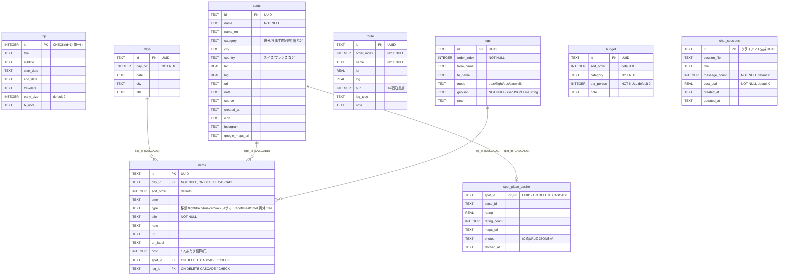

# データベース ER 図

`data/travel.db`（SQLite）の現在のテーブルスキーマ。



## items の詳細紐づけ制約（CHECK）

`items` は「地図に出せない無効な予定」を DB レベルで弾くため、`type` と外部キーを結びつけた CHECK 制約を持つ。Skill / API が直接 INSERT しても保証される。

```sql
CHECK (
     type = 'free'                                                                    -- 自由時間・機内泊は例外（どちらも不要）
  OR (type IN ('flight','train','bus','car','walk') AND leg_id  IS NOT NULL AND spot_id IS NULL)  -- 移動 → leg 必須
  OR (type IN ('spot','meal','hotel')               AND spot_id IS NOT NULL AND leg_id  IS NULL)  -- スポット → spot 必須
)
```

- 移動 item は `geojson` を持つ `legs`（NOT NULL）に紐づくので、必ず地図に描ける。
- 親（spot / leg）を削除すると該当 item も無効になるため、FK は `ON DELETE CASCADE`。

## 主キー（UUID）

`trip`（`id=1` 固定の単一行）を除き、全テーブルの主キーは `TEXT PRIMARY KEY NOT NULL`（UUID）。`crypto.randomUUID()` で採番する。

> SQLite では `INTEGER PRIMARY KEY`（rowid の別名）と違い、非 integer の `PRIMARY KEY` は `PRIMARY KEY` だけでは NULL を弾かない（後方互換の既知仕様）。そのため UUID の PK 列には `NOT NULL` を明示し、直接 SQL でも NULL id を防ぐ。
- サーバ / Skill / seed は INSERT 時に UUID を生成する（`lastInsertRowid` に依存しない）。
- フロント（旅程ビルダー）はクライアントで UUID を採番し、その id をそのまま POST する（楽観的更新時の一時 id 差し替えが不要）。
- API の各 POST は `body.id` があればそれを採用し、無ければサーバ側で採番する。

## 補足

外部キー制約があるのは以下の関係だけ。

| 子テーブル | 親テーブル | カラム | 削除時の挙動 |
|---|---|---|---|
| `items` | `days` | `day_id` | `ON DELETE CASCADE` |
| `items` | `spots` | `spot_id` | `ON DELETE CASCADE` |
| `items` | `legs` | `leg_id` | `ON DELETE CASCADE` |
| `spot_place_cache` | `spots` | `spot_id`（PK兼） | `ON DELETE CASCADE` |

### リレーションを持たない独立テーブル

- `trip` — `CHECK(id=1)` で単一行のみ。旅行全体のメタ情報。
- `route` — 地図表示用の地点リスト（`order_index` で並ぶ）。どこからも参照されない独立テーブル。
- `budget` — 費目リスト。
- `chat_sessions` — 会話履歴。外部キーは持たず独立。

> 注: `route` と `legs` は `from_name` / `to_name` / `name` を文字列で保持しており、`spots` や相互のテーブルとは FK で結ばれていない（地図側は座標・名前ベースで疎結合）。

## インデックス

| インデックス | 対象 |
|---|---|
| `idx_items_day` | `items(day_id, sort_order)` |
| `idx_route_order` | `route(order_index)` |
| `idx_legs_order` | `legs(order_index)` |
| `idx_chat_sessions_updated` | `chat_sessions(updated_at DESC)` |
