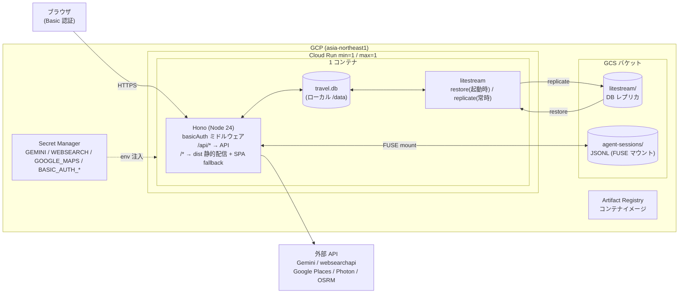
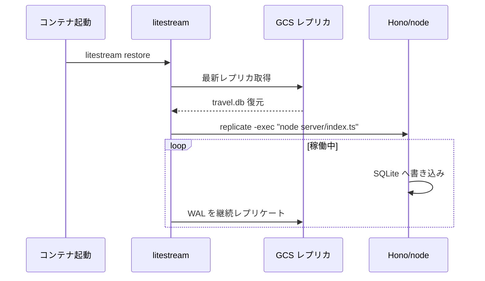
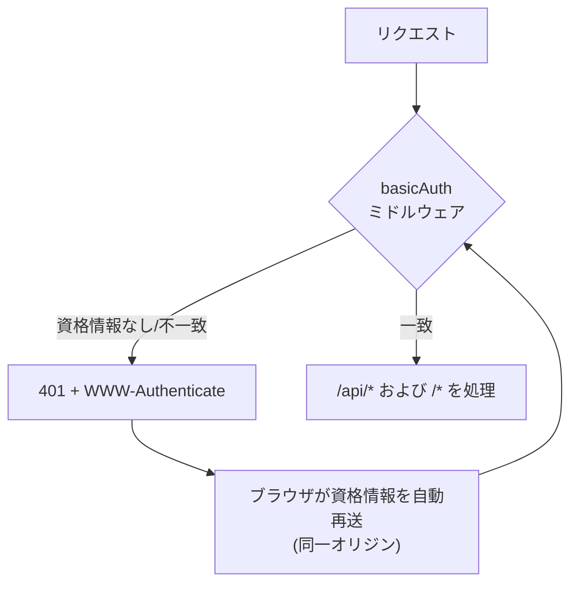
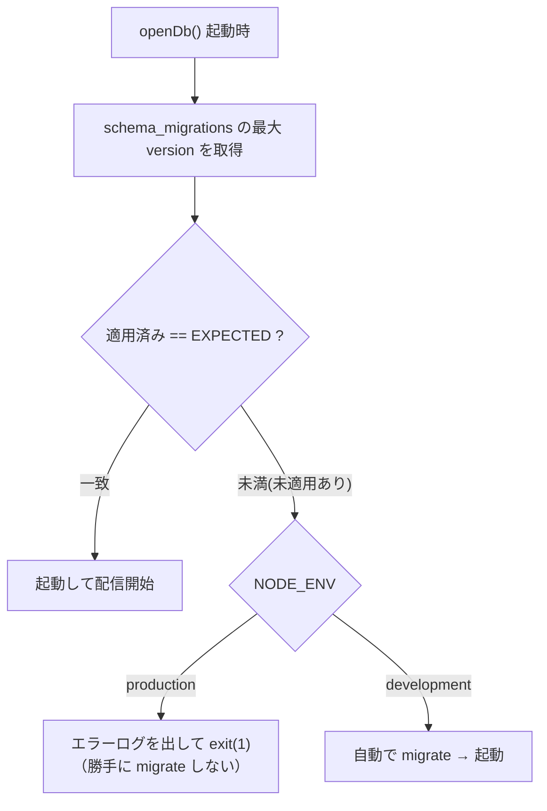
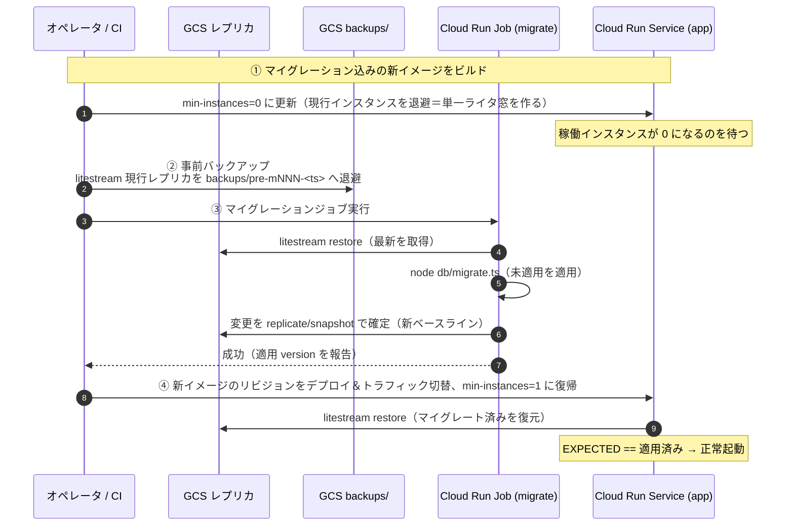

# GCP デプロイ設計（Cloud Run + Litestream）

しおりアプリ（React + Hono + SQLite）を GCP にデプロイするための設計。
ホスティングは **Cloud Run**、アクセス制御は **Basic 認証**（アプリ層）を採用する。

> **更新（マルチユーザー・共同編集 / #64・PR #65）**
> 本ドキュメントの初版はシングルテナント（共有 DB・Basic 認証）前提だが、以下へ移行した:
> - **認証**: Basic 認証 → **Google SSO（OIDC）+ 署名付き JWT Cookie**（`server/auth.ts`）。
>   Secret は `BASIC_AUTH_*` を廃し `GOOGLE_OAUTH_CLIENT_ID` / `GOOGLE_OAUTH_CLIENT_SECRET` / `SESSION_SECRET` を追加。
>   ログインは**オープン**（Google アカウントなら誰でも可）。`requireAuth` は JWT 検証のみでステートレス。
> - **テナント分離（per-project）**: 共有 `data/travel.db` → **プロジェクトごとに `data/{projectId}/travel.db` と
>   `agent-sessions/{projectId}/`** に物理分離（`server/storage.ts`）。1 プロジェクトを複数ユーザーで共同編集する
>   （変更はリロードで反映）。DB は open 時に `applyPending` で最新版へ追従（Cloud Run `max=1` 前提）。
> - **メンバーシップ**: **Firestore**（`users` プロフィール / `projects` 名前・オーナー・`memberEmails`）で管理。
>   参加は**メール招待**。リクエストは `X-Project-Id` ヘッダで対象を指定し、`requireProjectMember`（`server/projects.ts`）が
>   メンバー確認の上で per-project DB を解決する。アクセス境界はプロジェクトメンバーシップのみ。
> - **永続化（per-project Litestream）**: アプリ（`server/litestream.ts`）が各プロジェクト DB を開くたびに
>   `litestream restore`（GCS から復元）→ `litestream replicate`（子プロセスで常駐）を実行。`entrypoint.sh` は
>   Node を直接起動し、graceful shutdown で全 replicate を最終同期する。会話 JSONL は GCS FUSE で永続。
> - **後続整理**: 単一 DB 前提の `litestream.yml` / migrate Job（`TRAVEL_DB`）は用途消滅。残置だが後続で撤去する。
> 以降の「Basic 認証」節は初版の記録として残す。

## 1. 現状のアーキテクチャ

- **フロント**: React 19 + Vite + Tailwind 4 + deck.gl の SPA。`vite build` で静的 `dist/` を生成。
- **API**: Hono + `@hono/node-server`（Node 24 の `node:sqlite` と TS 型ストリップを利用）、`:8080`。
- **状態はローカルディスク `data/` に集約**:
  - `travel.db` … SQLite（約 110KB と極小）
  - `agent-sessions/*.jsonl` … AI チャット履歴（追記型）
- **外部依存**: Gemini / websearchapi.ai / Google Places / Photon(geocoding) / OSRM(routing)
- **シークレット**: `GEMINI_API_KEY` / `WEBSEARCH_API_KEY` / `GOOGLE_MAPS_API_KEY`

設計上の肝は **SQLite が単一ファイル・単一ライタ前提でローカルディスクに載っている**こと。
Cloud Run（ステートレス）との整合を取るのが主要課題。トラフィックはハネムーンのしおり
＝実質数人なので、その前提で最小構成にする。

## 2. 全体構成図



## 3. コンポーネント設計

### コンピュート — Cloud Run（第 2 世代）

- **1 サービス・1 コンテナ**でフロント（静的）と API を同居配信。構成が最少で済み、開発時の `/api` プロキシも不要になる。
- `min-instances=1` / `max-instances=1`。
  - **max=1 は SQLite の単一ライタ制約を守るため必須**。
  - min=1 で Litestream を常駐させ、コールドスタートを回避。
- concurrency はデフォルト（80）で十分（利用者は数人）。
- リージョン: `asia-northeast1`（東京）。

### フロント配信

- `vite build` の `dist/` を Hono の `serveStatic` で配信し、未マッチは `index.html` へフォールバック（react-router 対応）。
- Dockerfile をマルチステージ化（現状は API のみ → フロントビルドを追加）。

### SQLite の永続化 — Litestream



- `travel.db` はコンテナのローカルディスク（`/data`）に置く。
- 起動時に `litestream restore` で GCS から復元 → `litestream replicate -exec "node server/index.ts"` で常時レプリケーション。
- クラッシュ時に失う可能性があるのは直近数秒の書き込みのみ。書き込み頻度を踏まえ許容範囲。

### AI チャット履歴（agent-sessions/\*.jsonl）

- 追記型 JSONL なので **GCS FUSE ボリューム**を `/data/agent-sessions` にネイティブマウント（Cloud Run のボリューム機能）。gcsfuse と相性が良い。
- **SQLite は FUSE に載せない**（ロックが不安定なため）。役割分担が要点:
  - DB（ランダム書き込み） → ローカル + Litestream
  - JSONL（追記のみ） → GCS FUSE

### シークレット — Secret Manager

- `GEMINI_API_KEY` / `WEBSEARCH_API_KEY` / `GOOGLE_MAPS_API_KEY` / `BASIC_AUTH_USER` / `BASIC_AUTH_PASS` を格納し `--set-secrets` で環境変数として注入。`.env` はイメージに含めない。

### アクセス制御 — Basic 認証



- Hono の `basicAuth` を全ルートに適用。資格情報は Secret Manager 由来の env から読む。
- ブラウザは初回 401 応答後、同一オリジンへ資格情報を自動再送するため、`/api` の fetch もチャットの SSE ストリームも追加対応なく通る。
- Cloud Run 自体は「未認証の呼び出しを許可」で公開し、認証はアプリ層の Basic 認証で担保する。

## 4. 必要なコード / ファイル変更

| 対象 | 変更内容 |
| --- | --- |
| `server/index.ts` | `basicAuth` ミドルウェア追加、`serveStatic(dist)` + SPA フォールバック追加 |
| `Dockerfile` | マルチステージ化（builder で `vite build` → runtime に `dist` 同梱、litestream バイナリ導入） |
| `litestream.yml`（新規） | DB → GCS レプリケーション定義 |
| `entrypoint.sh`（新規） | `litestream restore` → `litestream replicate -exec` |
| `.gcloudignore`（新規） | ソース同梱デプロイ時の除外 |
| `cloudbuild.yaml`（新規・任意） | ビルド → push → deploy の自動化 |

`db.ts` / `TRAVEL_DB` は環境変数対応済みのため **DB 層の変更は不要**。

## 5. デプロイ手順（概略）

```bash
# 1. 事前準備（1回）
gcloud config set project <PROJECT_ID>
gcloud services enable run.googleapis.com artifactregistry.googleapis.com \
  secretmanager.googleapis.com cloudbuild.googleapis.com
gsutil mb -l asia-northeast1 gs://<PROJECT_ID>-shiori-state

# シークレット登録（各キー）
printf '%s' "$GEMINI_API_KEY" | gcloud secrets create GEMINI_API_KEY --data-file=-
# … 他キーと BASIC_AUTH_USER / BASIC_AUTH_PASS も同様

# 2. デプロイ
gcloud run deploy shiori \
  --source . --region asia-northeast1 \
  --min-instances 1 --max-instances 1 \
  --allow-unauthenticated \
  --add-volume name=sessions,type=cloud-storage,bucket=<PROJECT_ID>-shiori-state \
  --add-volume-mount volume=sessions,mount-path=/data/agent-sessions \
  --set-secrets GEMINI_API_KEY=GEMINI_API_KEY:latest,WEBSEARCH_API_KEY=WEBSEARCH_API_KEY:latest,\
GOOGLE_MAPS_API_KEY=GOOGLE_MAPS_API_KEY:latest,BASIC_AUTH_USER=BASIC_AUTH_USER:latest,\
BASIC_AUTH_PASS=BASIC_AUTH_PASS:latest \
  --set-env-vars TRAVEL_DB=/data/travel.db,LITESTREAM_BUCKET=<PROJECT_ID>-shiori-state
```

- 初回 `travel.db` は、seed 済み DB を GCS レプリカへ手動アップロードするか、
  初回起動で空作成 → `db:init` を流す。

## 6. コスト・運用の目安

- **Cloud Run min=1**: 常時 1 インスタンス（最小 CPU / メモリ）で概ね月 $5〜10 程度。
- **GCS**: 容量が極小のためほぼ無視できる。
- デプロイは後述の理由から未使用時間帯に実施する運用とする。

## 7. 設計上の注意（トレードオフ）

- Cloud Run はデプロイ時に**新旧リビジョンが一瞬並走**する。両方が SQLite を書くと
  GCS レプリカが競合する恐れがあるため、**デプロイは未使用時間帯に行う**
  （または `--no-traffic` で新リビジョンを起こしてからトラフィック切替）。
- データが極小・書き込みが稀なため実害はほぼ出ないが、
  ここが「serverless + SQLite」の構造的な妥協点である。

## 参考: 除外した代替案

| 案 | 却下理由 |
| --- | --- |
| Compute Engine e2-micro VM | SQLite は完全に動くが OS / TLS を自前運用。今回は Cloud Run を選択。 |
| Cloud Run + GCS FUSE 全マウント | 構成は最単純だが SQLite のファイルロックが gcsfuse で不安定になりうる。 |
| Cloud Run + Cloud SQL | node:sqlite からの移行（コード書き換え）が必要で、規模に対して過剰。 |
| Cloud Run + Filestore(NFS) | POSIX で SQLite は動くが Filestore 最小構成が高額（月 $200+）。過剰。 |

---

# スキーマ変更（マイグレーション）設計

本番稼働後にテーブル・列を追加/変更する際の、安全な反映フロー。

## 8. 現状の課題

現状、スキーマ変更は **2 系統が併存**していて、どちらも本番運用には使えない。

**(a) `db/db.ts` の `migrate()` — 毎起動で命令的に列を追加/削除**

```ts
// 現状（db/db.ts）— バージョン管理も適用履歴もない
function migrate(db) {
  addColumnIfMissing(db, "spots", "icon", "TEXT");
  addColumnIfMissing(db, "items", "leg_id", "TEXT REFERENCES legs(id) ON DELETE CASCADE");
  dropColumnIfExists(db, "spots", "want_level");
  // …
}
```

**(b) `db/migrations/000X_*.sql` — 手作業で流す一回きりの SQL**

```
db/migrations/
  0001_item_spot_leg_constraint.sql   # items に CHECK、legs.geojson を NOT NULL 化
  0002_uuid_ids.sql                   # PK を INTEGER → TEXT(UUID) 化
  0003_pk_not_null.sql                # UUID PK に NOT NULL を明示
```

問題点:

- **ランナーも適用履歴もない**。`schema_migrations` / `user_version` を持たず、
  `sqlite3 data/travel.db < 000X.sql` を**人手で流す**運用。「どこまで適用済みか」を DB が知らない。
- **既存 `000X` は本番では使えない**。0002/0003 は「対象テーブルを **DROP → `schema.sql` で作り直し → `seed.ts --reset`**」
  という **データ破棄前提**の開発用スクリプト（移行性を考慮しない方針）。本番データが消える。
- (a) の ad-hoc `migrate()` が (b) と二重管理になっており、冪等性が「列の存在チェック」頼みで
  **データ変換を伴う変更や破壊的変更に耐えない**。
- **Litestream 併用時に致命的**: Cloud Run の各インスタンスは GCS レプリカから復元した
  **別々のローカル DB ファイル**を持つ。デプロイ時に新旧リビジョンが並走すると、
  両方が同時にマイグレート＆レプリケートし、Litestream のレプリカ世代が競合する。
  SQLite のロックはインスタンスをまたいで効かないため、DB 破損リスクになる。

→ 既存の `000X` は **「本番稼働前（データ破棄可）の開発用改修」** と位置づけ、
  現在の `schema.sql`（UUID/CHECK/NOT NULL の最終形）を **本番の起点（genesis）** とする。
  以降を **「versioned migration」＋「単一ライタ窓での実行」** に作り替える。

## 9. マイグレーション基盤の設計

### 連番マイグレーションファイル（前方専用）

既存の `db/migrations/000X_*.sql`（4 桁連番）の命名規約をそのまま踏襲する。

```
db/
  schema.sql            # 「現在の最終形」。新規 DB 作成用（CREATE IF NOT EXISTS）
  migrations/
    0001_item_spot_leg_constraint.sql   # 既存（本番稼働前・データ破棄可の開発用）
    0002_uuid_ids.sql                   # 既存（同上）
    0003_pk_not_null.sql                # 既存（同上）
    0004_<本番後の最初の変更>.sql        # ここから先が「本番向け・前方専用・データ保全」
    ...
```

- **0001〜0003** は本番稼働前の開発用改修。本番の起点（`schema.sql`）に畳み込み済みとして扱い、
  本番 DB に対しては**流さない**（§12 参照）。
- **0004 以降** が本番向けの versioned migration。各ファイルは **up のみ・前方専用**
  （down は持たない。ロールバックはバックアップ復元で行う）・**データを破棄しない**。
- 番号昇順で適用。

### 適用履歴テーブル

```sql
CREATE TABLE IF NOT EXISTS schema_migrations (
  version    INTEGER PRIMARY KEY,
  name       TEXT NOT NULL,
  applied_at TEXT NOT NULL DEFAULT (datetime('now'))
);
```

### ランナー `db/migrate.ts`

- 未適用（`version > max(applied)`）のファイルを昇順に、**1 ファイル = 1 トランザクション**
  （`BEGIN IMMEDIATE` … `COMMIT`）で適用し、`schema_migrations` に記録。
- トランザクション内で再度 version を確認し、二重適用を防ぐ。
- CLI: `node db/migrate.ts`（適用）/ `--status`（状態表示）/ `--baseline`（後述）。

### アプリ起動時は「自動適用しない・フェイルファスト」

コードに期待スキーマ版 `EXPECTED_SCHEMA_VERSION` を持たせ、起動時に検証する。



- **本番では自動マイグレートしない**。未適用があれば起動を拒否し、マイグレーションジョブ（後述）を促す。
  → 複数インスタンスが各自マイグレートする事故を根本から防ぐ。
- 開発では利便性のため自動適用（従来どおりの体験）。

## 10. 本番反映フロー（Cloud Run + Litestream）

肝は **「書き込み手が 1 つだけの窓」でマイグレーションを実行し、GCS レプリカを更新してから新リビジョンを配信する**こと。



補足:

- **単一ライタ窓**: `min-instances=0` にして現行を退避 → 稼働 0 を確認してからジョブ実行。
  これで「アプリ」と「ジョブ」が同時に書く状況を作らない。
- **マイグレーションジョブ**は同じイメージを `entrypoint` だけ差し替えて Cloud Run Job として実行
  （`litestream restore → migrate → 確定`）。GCS バケット / Secret は Service と共有。
- **失敗時**: ジョブが非ゼロ終了 → 新リビジョンは配信しない。バックアップは無傷なので、
  旧イメージで `min-instances=1` に戻せば即復旧。
- **デプロイの自動分岐**: `deploy` ワークフローは push に `db/migrations/` の差分が
  含まれるかを判定し、**スキーマ変更時だけ** デプロイ前に単一ライタ窓での migrate を自動で挟む:
  - コード変更のみ → `build → deploy`（無停止でイメージ差し替え）
  - スキーマ変更あり → `build → 退避(min=0) → バックアップ → migrate Job → deploy(min=1)`
  未適用のまま deploy するとフェイルファストで起動拒否になるため、この順序を1本のフローで保証する。
  migrate 失敗時は旧リビジョンを `min=1` に戻して可用性を復帰する。

## 11. バックアップ & ロールバック

- マイグレーション前に必ず **タイムスタンプ付きスナップショット**を
  `gs://<bucket>/backups/pre-mNNN-<ts>.db` として退避（`litestream` のレプリカ or `gsutil cp`）。
- マイグレーションは前方専用。**ロールバック = 「バックアップ復元 + 旧イメージ再デプロイ」**。
  down マイグレーションは書かない（破壊的変更の逆操作は事故りやすいため）。
- 日次の自動バックアップも `gs://<bucket>/backups/daily/` に別途取得しておくと安心
  （Cloud Scheduler + Job、任意）。

## 12. 本番 DB の起点（genesis）と baseline

本番はまだ稼働しておらず、`schema.sql` が UUID/CHECK/NOT NULL の最終形になっている。
そこで **「現在の `schema.sql` を version 3 相当の起点」** と定義し、次のように整合させる。

1. **初回デプロイ**: `schema.sql`（最終形）で新規 DB を作成し、
   `node db/migrate.ts --baseline` で **0001〜0003 を「適用済み」として `schema_migrations` に記録**する
   （SQL は再実行しない＝データ破棄を起こさない）。以後 `max(version)=3` から始まる。
2. **既存の開発 DB を本番へ持ち込む場合**: ローカルで `0001〜0003` を手作業適用済み（＋ `seed.ts --reset`）
   の DB を作り、それを GCS レプリカの初期状態として一度アップロードしてから baseline 記録する。
3. **`db.ts` の ad-hoc `migrate()` は撤去**し、起動時は §9 のフェイルファスト検証のみ行う
   （列追加ロジックは versioned migration に一本化）。
4. 本番稼働後の変更は **0004 以降**を追加してジョブで適用（§10）。

> ポイント: 0001〜0003 は「本番の起点に既に含まれている」ものとして記録するだけで、
> **本番 DB に対して実行はしない**（実行するとデータが飛ぶ）。

## 13. マイグレーションで守るルール

- **前方専用・追記のみ**。既存 migration ファイルは編集/削除しない（適用済み環境と乖離するため）。
- 列削除やリネーム等の破壊的変更は、可能なら **expand → migrate → contract** の多段で行い、
  1 デプロイに 1 段だけ含める（旧コードと新コードが一瞬併存しても壊れないように）。
- 大きなデータ変換は migration SQL ではなくアプリ側のバッチに寄せることも検討。
- SQLite の制約（`ALTER TABLE` は列追加/リネーム中心。複雑な変更は
  「新テーブル作成 → コピー → 旧削除 → リネーム」パターン）を前提に書く。
